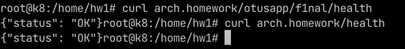

## Домашнее задание 1

Тестировалось на Ubuntu + microk8s

```shell
snap install microk8s --classic
microk8s.enable dns ingress  metrics-server  storage

microk8s kubectl apply -f k8s
```

# Тестирование сервиса

```
curl -H 'Host: arch.homework' http://IP/health
curl -H 'Host: arch.homework' http://IP/otusapp/f1nal/health
```

